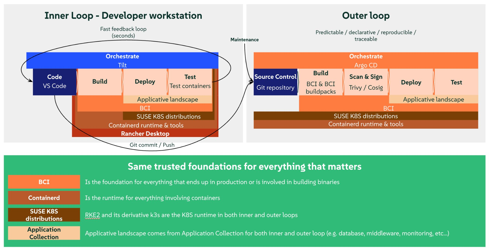

# 📮 Message Wall — Kubernetes Developer Demo

A small interactive message wall running on Kubernetes, designed to demonstrate a modern developer inner loop with **Rancher Desktop**, **SUSE Application Collection**, and **Tilt**.

Post messages, delete them, change the accent color — and watch everything update in seconds. Metrics are collected by Prometheus and displayed in a Grafana dashboard, auto-provisioned from code. Authentication is handled by Keycloak.



## 1. 🖥️ Install Rancher Desktop

Download and install from [rancherdesktop.io](https://rancherdesktop.io).

Once installed, open Rancher Desktop and configure:

- **Container Engine:** select **dockerd (moby)** (not containerd)
- **Kubernetes:** enabled (default)

Wait for the cluster to be ready (green indicator in the status bar).

## 2. 🟢 Enable SUSE Application Collection

In Rancher Desktop, go to **Extensions** and install the **SUSE Application Collection** extension. This gives you access to a set of trusted container images and Helm charts directly from the Rancher Desktop UI.

Once enabled, a new **Application Collection** tab appears in the sidebar. The extension also configures registry authentication automatically.

## 3. 📦 Install PostgreSQL, Prometheus, and Grafana

All three are installed from the **Application Collection** tab in Rancher Desktop. For each one, click **Install**, then paste the corresponding values from the `values_yaml/` folder in this repo.

**PostgreSQL:**

1. Application Collection → search **PostgreSQL** → **Install**
2. Click "Upload values.yaml" and select `values_yaml/postgresql.yaml`
2. Click "Upload values.yaml" and select `values_yaml/postgresql.yaml`
3. Click **Install**

**Prometheus:**

1. Application Collection → search **Prometheus** → **Install**
2. Click "Upload values.yaml" and select `values_yaml/prometheus.yaml`
2. Click "Upload values.yaml" and select `values_yaml/prometheus.yaml`
3. Click **Install**

**Grafana:**

1. Application Collection → search **Grafana** → **Install**
2. Click "Upload values.yaml" and select `values_yaml/grafana.yaml`
2. Click "Upload values.yaml" and select `values_yaml/grafana.yaml`
3. Click **Install**

Wait a minute or two for all pods to be ready. You can check progress in the Rancher Desktop **Pods** view or with:

```bash
kubectl get pods
```

All pods should show `Running`.

**What about Keycloak?**

Keycloak provides OAuth2 authentication for the Message Wall, but there is no Helm chart for it on SUSE Application Collection. Instead, Tilt deploys it automatically as a plain Kubernetes Deployment using the SUSE Application Collection container image (`dp.apps.rancher.io/containers/keycloak`). It stores its data in the same PostgreSQL instance, and Tilt imports a pre-configured realm (demo user + OAuth client) via the Admin REST API — no manual setup needed.

## 4. ⚙️ Install Tilt

**macOS:**

```bash
brew install tilt
```

**Linux (SUSE and others):**

```bash
curl -fsSL https://raw.githubusercontent.com/tilt-dev/tilt/master/scripts/install.sh | bash
```

**Windows (PowerShell):**

```powershell
iex ((new-object net.webclient).DownloadString('https://raw.githubusercontent.com/tilt-dev/tilt/master/scripts/install.ps1'))
```

Verify: `tilt version`

## 5. 🚀 Clone and run

```bash
git clone https://github.com/fxHouard/Rancher-Developer-Access-Demo.git
cd Rancher-Developer-Access-Demo
tilt up
```

Press **Space** to open the Tilt dashboard in your browser.

## 6. 🎯 Explore

From the Tilt dashboard ([localhost:10350](http://localhost:10350)), you have clickable links to:

| Resource | URL | What |
|---|---|---|
| **message-wall** | [localhost:3000](http://localhost:3000) | The Message Wall app |
| **keycloak** | [localhost:8080](http://localhost:8080) | Keycloak (login: admin / admin) |
| **grafana** | [localhost:3001](http://localhost:3001) | Grafana (login: admin / admin) |
| **grafana-config** | [localhost:3001/d/message-wall/](http://localhost:3001/d/message-wall/) | Grafana dashboard (direct link) |
| **prometheus** | [localhost:9090](http://localhost:9090) | Prometheus |

**Try it:**

1. Open the **Message Wall** ([localhost:3000](http://localhost:3000)) and post a few messages.
2. Open the **Grafana dashboard** — metrics update in real time (requests/sec, messages count, response time, memory).
3. In `src/server.js`, change the `ACCENT_COLOR` value (line 9), save. In ~2 seconds, the wall color changes without losing messages — that's Tilt's live update in action.

## 🎯 How it works

The **Tiltfile** orchestrates the developer inner loop:

- Builds the app image locally (no push — Rancher Desktop shares the image store between dockerd and k3s)
- Auto-detects PostgreSQL, Prometheus, and Grafana services by Kubernetes labels
- Deploys the app with dynamic PostgreSQL service name injection
- Deploys Keycloak from its Application Collection container image and configures the realm automatically
- Generates a Prometheus datasource ConfigMap so Grafana finds Prometheus automatically
- Applies the Grafana dashboard ConfigMap (8 panels, auto-provisioned via sidecar)
- Sets up port-forwards and clickable links for all services

## 📁 Project structure

```
.
├── src/
│   └── server.js              Application (API + UI + Prometheus metrics)
├── k8s/
│   ├── appco/
│   │   ├── deployment.yaml    Pod spec with Prometheus annotations
│   │   ├── service.yaml       ClusterIP service
│   │   └── keycloak.yaml      Keycloak Deployment + Service (Application Collection image)
│   └── shared/
│       ├── grafana-dashboard.yaml   8-panel dashboard (auto-provisioned)
│       └── keycloak-realm.json      Realm config (demo user + OAuth client)
├── scripts/
│   └── setup-keycloak-realm.sh      Keycloak realm import script
├── values_yaml/
│   ├── postgresql.yaml        Helm values for PostgreSQL
│   ├── prometheus.yaml        Helm values for Prometheus
│   └── grafana.yaml           Helm values for Grafana
├── Dockerfile                 Container image (Application Collection base)
├── Tiltfile                   Inner loop config (build, deploy, sync, monitoring)
└── package.json
```

## 📖 Documentation

For the full crash course covering the complete Kubernetes developer workflow (Dev Containers, Tilt, mirrord, Testcontainers, Helm, GitOps, security):

👉 **[Developing for Kubernetes with SUSE Rancher Developer Access](docs/developing-for-kubernetes.md)**

---

## 🔍 CVE Comparison (Shadow Mode)

The `shadow/` subfolder contains an extended variant of this demo that deploys the entire stack a second time using public upstream images (Docker Hub, Quay.io), scans both variants with Trivy, and compares CVE counts side-by-side in a dedicated Grafana dashboard. See `shadow/` for details.
